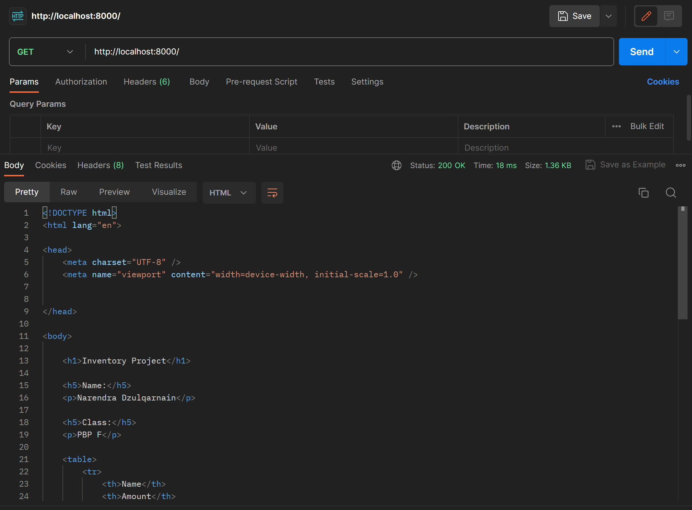
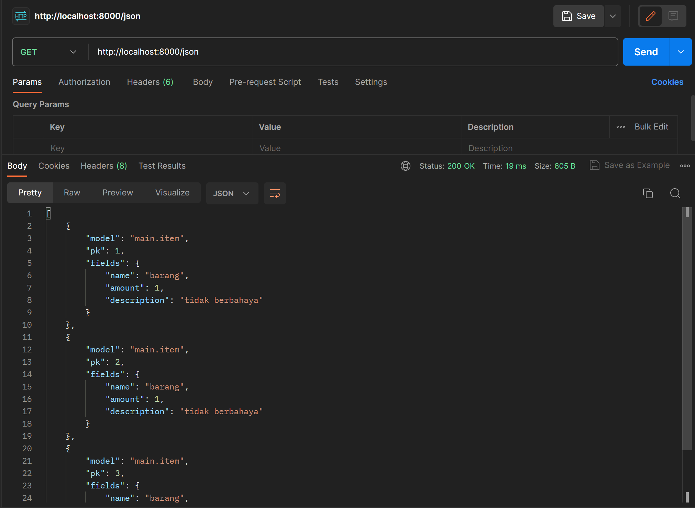
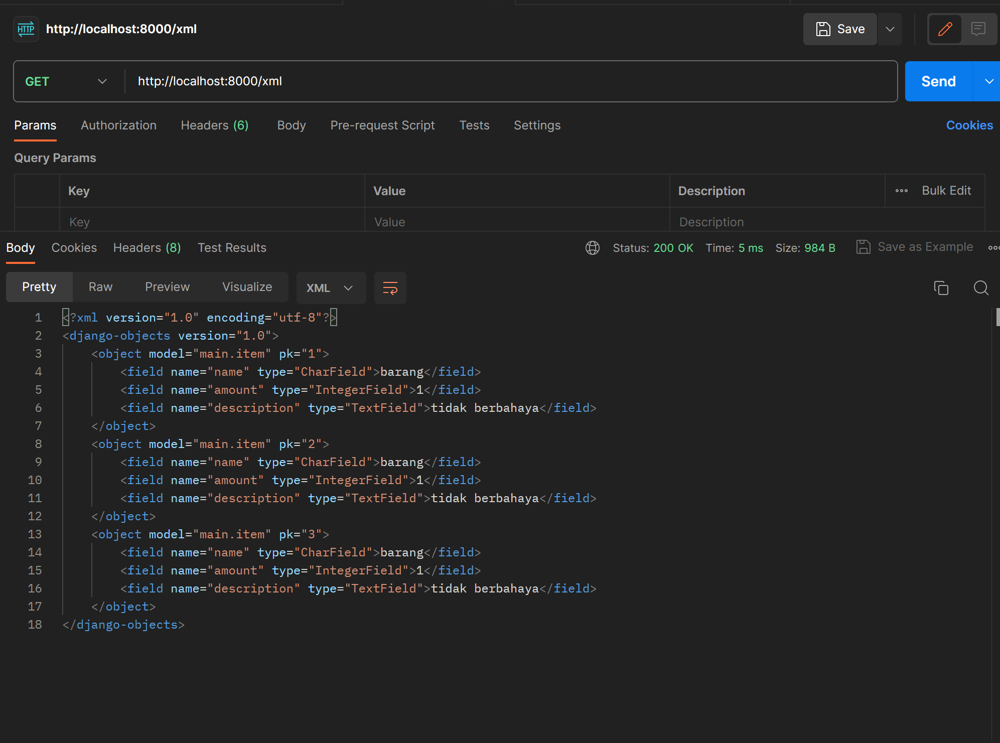
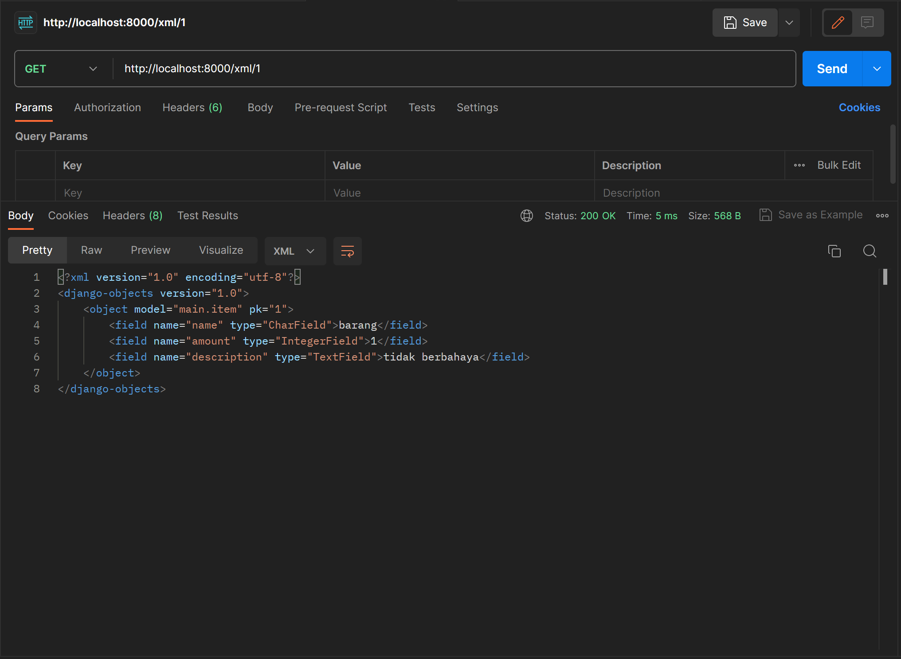
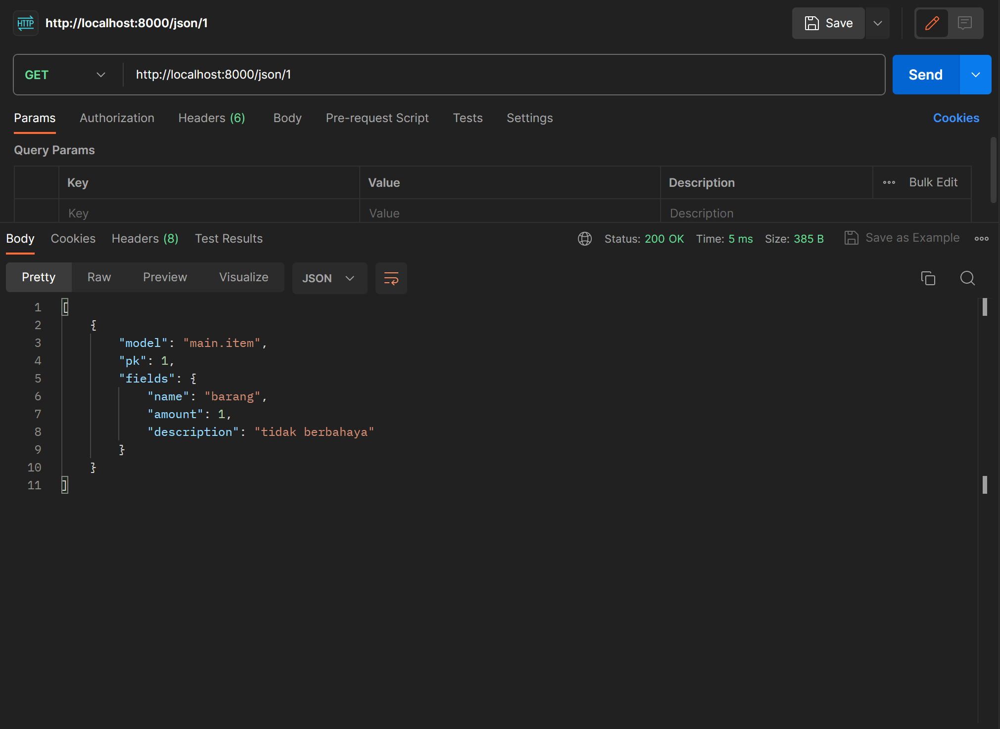
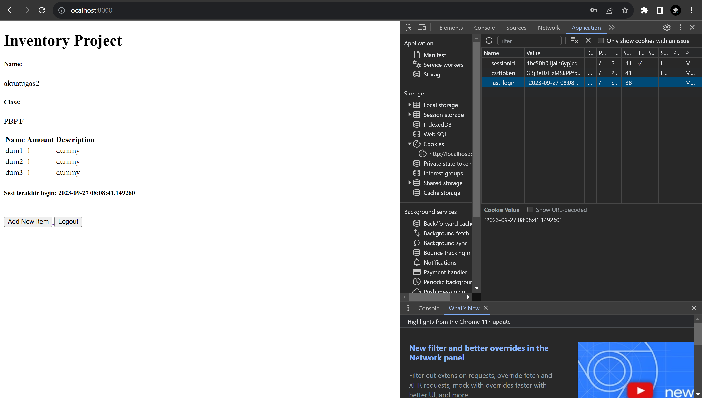

<h4>1. Jelaskan bagaimana cara kamu mengimplementasikan checklist di atas secara step-by-step (bukan hanya sekadar mengikuti tutorial).</h4>

- Membuat direktori lokal untuk project  
- Inisiasi git  
- Buat dan aktifkan virtual environment.  
- Menginstall dependencies.  
- Start project django  
- Mengatur konfigurasi Allowed hosts pada settings.py  
- Membuat aplikasi main dan menambahkannya ke daftar proyek  
- Membuat direktori untuk template dan menambahkan file template yaitu main.html  
- Mengisi main.html sesuai kebutuhan  
- Membuat model dengan nama Item dengan atribut nama, amount dan description  
- Migrasi model  
- Membuat fungi show_main pada berkas views.py dan mengisi data yang akan ditampilkan  
- Konfigurasi routing URL aplikasi main dengan menambahkan fungsi show_main ke list urlpatterns pada urls.py  
- Konfigurasi routing URL proyek  
- Buat repositori baru di github untuk proyek  
- Setelah keluar dari virtual environment, lakukan add dan commit pada direktori proyek  
- Buat branch utama baru, hubungkan direktori lokal dengan repositori github, lalu push

<h4>2. Buatlah bagan yang berisi request client ke web aplikasi berbasis Django beserta responnya dan jelaskan pada bagan tersebut kaitan antara urls.py, views.py, models.py, dan berkas html.</h4>

urls.py akan meneruskan request ke views.py, lalu views.py akan mengambil data yang diperlukan dari models.py lalu ditampilkan melalui berkas .html

<h4>3. Jelaskan mengapa kita menggunakan virtual environment? Apakah kita tetap dapat membuat aplikasi web berbasis Django tanpa menggunakan virtual environment?</h4>

Virtual environment digunakan untuk menghindari konflik dependencies dari proyek berbeda. Virtual environment mengisolasi package dan dependencies dari aplikasi 
Kita tetap bisa membuat aplikasi django tanpa virtual environment. Namun, jika kita mengerjakan lebih dari satu proyek dengan versi django yang berbeda, maka akan terjadi konflik akibat perbedaan versi django pada perangkat lokal.

<h4>4. Jelaskan apakah itu MVC, MVT, MVVM dan perbedaan dari ketiganya.</h4>

MVC, MVT dan MVVM merupakan design pattern yang digunakan dalam pemrograman berbasis platform. 
<b>MVC (Movdel-View-Controller)</b> 
- Model: Mewakili data dan logika bisnis 
- View: Menampilkan data kepada pengguna 
- Controller: Perantara antara view dan model, mengelola interaksi pengguna 
<b>MVT (Model-View-Template)</b> 
- Model: Mewakili data 
- View: Bagian logika bisnis, menampilkan template kepada pengguna 
- Template: Tampilan html yang dapat disesuaikan dengan input pada model 
<b>MVVM (Model-View-ViewModel)</b> 
- Model: Mewakili data 
- View: Menampilkan data kepada pengguna 
- ViewModel: Mengubah data dari Model menjadi format yang lebih sesuai untuk tampilan.  
ViewModel juga menangani perintah dari View dan memperbarui Model jika diperlukan. 

<h3>TUGAS 3</h3>
<h4>1. Apa perbedaan antara form POST dan form GET dalam Django?</h4>

Dalam <b>POST</b>, browser mengumpulkan data dari form, me-<i>encode</i> datanya, mengirimkan datanya ke server, lalu menerima response. Oleh karena itu, POST biasanya digunakan untuk operasi yang mengubah atau membuat data di server.  
<b>GET</b> disisi lain, mengumpulkan data yang disubmisi ke dalam string dan menggunakannya untuk membuat URL. URL-nya mengandung alamat ke mana data harus dikirim, termasuk <i>keys</i> dan <i>value</i> dari data. Oleh karena itu, GET cocok untuk operasi <i>read-only</i>.
  

<h4>2. Apa perbedaan utama antara XML, JSON, dan HTML dalam konteks pengiriman data?</h4>

XML menyajikan data dalam bentuk elemen yang diapit oleh <i>tags</i> dan dengan struktur hierarki 
JSON menyajikan data dalam bentuk pasangan <i>key-value</i> 
HTML digunakan untuk menampilkan halaman web dari request
  
<h4>3. Mengapa JSON sering digunakan dalam pertukaran data antara aplikasi web modern?</h4>

Karena JSON memiliki struktur yang simpel sehingga mudah dibaca, ditulis dan dipahami. JSON juga dapat diubah ke objek JavaScript sehingga lebih nyaman untuk web developer yang menggunakan JavaScript.
  
<h4>4. Jelaskan bagaimana cara kamu mengimplementasikan checklist di atas secara step-by-step (bukan hanya sekadar mengikuti tutorial).</h4>

- Membuat folder baru bernama templates lalu buat file dengan nama base.html pada folder tersebut. 
- Isi file sesuai dengan yang ada di tutorial 
- Tambahkan base.html sebagai template pada settings.py di subdirektori project_inventory  
- Ubah main.html agar meng-extend base.html 
- Buat berkas baru pada direktori main dengan nama forms.py  
- Atur isi forms.py dengan model yang akan digunakan beserta field yang akan diisi pada form  
- Buat fungsi baru bernama create_product untuk menghasilkan form yang dapat menambahkan data item secara otomatis ketika data di submit. 
- Tambahkan items pada fungsi show_main 
- import fungsi create_product pada urls.py di main, dan tambahkan path urlnya 
- Buat berkas bernama create_product.html pada main/templates dan sesuaikan isinya dengan tutorial 
- Tambahkan kode yang ada di tutorial pada main.html. Sesuaikan atribut-atributnya dengan model yang digunakan (item) 
- import HttpResponse dan serializers pada main/views.py lalu buat fungsi bernama show_xml 
- Tambahkan data = Item.objects.all() pada fungsi lalu return HttpResponse dalam bentuk xml menggunakan serializer 
- Lakukan hal yang sama untuk JSON 
- Buat fungsi baru bernama show_xml_by_id dan tambahkan parameter id 
- Tambahkan data = Product.objects.filter(pk=id) pada fungsi lalu return HttpResponse dala bentuk xml menggunakan serializer 
-Lakukan hal serupa untuk JSON
 
<h4>5. Mengakses kelima URL di poin 2 menggunakan Postman, membuat screenshot dari hasil akses URL pada Postman, dan menambahkannya ke dalam README.md.</h4>

<h3>TUGAS 4</h3>
<h4>1. Apa itu Django UserCreationForm, dan jelaskan apa kelebihan dan kekurangannya? </h4>

Django UserCreationForm adalah modul <i>build-in</i> dari django yang digunakan untuk membuat <i>user</i> pada 
aplikasi web. Kelebihan UserCreationForm adalah terdapat <i>built-in validation</i> untuk isian seperti <i>username</i> dan <i>password</i>
untuk memastikan bahwa input user valid. Sebagai contoh, UserCreationForm memastikan <i>user</i> mengisi password yang memenuhi kriteria
password kuat. Namun, UserCreationForm mungkin tidak cocok untuk form registrasi yang kompleks, misal form registrasi
yang memerlukan tambahan <i>fields</i>/data dari <i>user</i> atau form yang memiliki banyak lapisan
  
<h4>2. Apa perbedaan antara autentikasi dan otorisasi dalam konteks Django, dan mengapa keduanya penting?</h4>

Autentikasi adalah proses memverifikasi informasi <i>user</i> yang ingin masuk, sedangkan otorisasi adalah proses memverifikasi
apakah <i>user</i> tersebut memiliki akses terhadap sesuatu. Keduanya merupakan proses verifikasi yang penting
dalam keamanan aplikasi. Autentikasi diperlukan untuk memastikan pengguna yang ingin masuk memang valid. Otorisasi 
diperlukan untuk menentukan hak/akses dari pengguna tersebut.
 
<h4>3. Apa itu cookies dalam konteks aplikasi web, dan bagaimana Django menggunakan cookies untuk mengelola data sesi pengguna?</h4>

Cookies adalah informasi berukuran kecil yang dikirim dari <i>web server</i> ke <i>browser</i> dan dikirimkan kembali
oleh <i>browser</i> ke <i>web server</i> pada permintaan halaman berikutnya. Django memberikan <i>session id</i> yang unik
ketika pengguna masuk ke website. <i>Session id</i> tersebut disimpan dalam cookie dengan nama <i>default</i> "sessionid".
<i>Session id</i> ini digunakan untuk mengasosiasikan pengguna dengan data <i>session</i>
yang tersimpan di server.
  
<h4>4. Apakah penggunaan cookies aman secara default dalam pengembangan web, atau apakah ada risiko potensial yang harus diwaspadai?</h4>

Penggunaan cookies aman secara general meskipun tetap ada risiko potensial yang harus diwaspadai. Contohnya XSS, CSRF, atau Cookies/Session
posioning.
  
<h4>5. Jelaskan bagaimana cara kamu mengimplementasikan checklist di atas secara step-by-step (bukan hanya sekadar mengikuti tutorial).</h4>
<h5>Mengimplementasikan fungsi registrasi, login, dan logout untuk memungkinkan pengguna untuk mengakses aplikasi sebelumnya dengan lancar.</h5>

* Buka main/views.py lalu import redirect, UserCreationForm, dan messages  
* Buat fungsi bernama register yang menerima parameter request dengan isi fungsi seperti di tutorial 
* Buat berkas baru bernama register.html pada main/templates dan isi dengan template pada tutorial 
* import fungsi register tadi ke urls.py lalu tambahkan ke dalam path 
* import authenticate dan login pada views.py 
* Buat fungsi login bernama login_user seperti yang ada di tutorial 
* Buat berkas baru bernama login.html pada main/templates dan isi berkas dengan template pada tutorial 
* Tambahkan path untuk fungsi login di urls.py 
* Lakukan hal yang serupa untuk logout 
* Untuk merestriksi halaman main, import login_required pada views.py  
* Tambahkan kode yang ada di tutorial di atas fungsi show_main 

<h5>Membuat dua akun pengguna dengan masing-masing tiga dummy data menggunakan model yang telah dibuat pada aplikasi sebelumnya untuk setiap akun di lokal.</h5>

* Jalankan aplikasi lalu akses halaman web menggunakan browser  
* Lakukan register lalu login 
* Tekan tombol add item lalu tambahkan item 
* register akun kedua lalu lakukan hal yang serupa  

<h5>Menghubungkan model Item dengan User.</h5>

    * import User pada main/models.py  
    * Tambahkan potongan kode yang ada di tutorial pada class Item  
    * Buka main/views.py dan lakukan perubahan pada fungsi create_product dan show_main seperti di tutorial  
    * Lakukan migrasi  

<h5>Menampilkan detail informasi pengguna yang sedang logged in seperti username dan menerapkan cookies seperti last login pada halaman utama aplikasi.</h5>

    * Buka main/views.py lalu import HttpResponseRedirect, reverse, dan datetime 
    * Pada fungsi login_user, tambahkan cookie bernama last_login seperti di tutorial 
    * Ubah fungsi show_main seperti pada tutorial 
    * Ubah fungsi logout_user seperti di tutorial agar cookie dihapus ketika logout 
    * Login menggunakan akun yang sudah dibuat atau registrasi terlebih dahulu jika belum membuat akun 
    * Tekan F12 pada keyboard untuk inspect website 
    * Lihat ke halaman application lalu cookies 

<h3>TUGAS 5</h3>
<h4>1. Jelaskan manfaat dari setiap element selector dan kapan waktu yang tepat untuk menggunakannya.</h4>

    1. Element selector  
    Dapat mengubah properti untuk semua elemen dengan tag html sama. Waktu yang tepat untuk menggunakannya adalah ketika kita ingin
    properti yang konsisten untuk suatu tag. Contoh, mengatur font dan warna untuk h1 agar setiap elemen h1 memiliki properti sama. 
    2. ID selector 
    Dapat mengubah properti elemen berdasarkan ID pada tag. Waktu yang tepat untuk menggunakannya adalah ketika kita ingin memberikan 
    <i>style</i> pada elemen yang spesifik. 
    3. Class selector
    Dapat mengubah properti lebih dari satu elemen yang memiliki atribut class yang sama. Waktu yang tepat untuk menggunakannya adalah
    ketika kita ingin memberikan <i>style</i> spesifik untuk sekelompok elemen atau menerapkan properti yang konsisten untuk sekelompok
    elemen dengan class yang sama.

<h4>2. Jelaskan HTML5 Tag yang kamu ketahui.</h4>
<pre>
    &lt;head&gt; : bagian dari struktur dokumen html untuk memberikan informasi mengenai halaman web
    &lt;br&gt; :  next line
    &lt;body&gt; : elemen body
    &lt;button&gt; : untuk tombol
    &lt;center&gt; : align-center suatu text
    &lt;b&gt; : bold
    &lt;i&gt; : italic
    &lt;link&gt; : merefrensikan link
    &lt;p&gt; Membuat paragraf
    &lt;table&gt; : membuat tabel
    &lt;th&gt; : header dari tabel    
</pre>
<h4>3. Jelaskan perbedaan antara margin dan padding.</h4>
<pre>
    Margin merupakan ruang/jarak diantara elemen yang bersebelahan sedangkan padding adalah ruang/jarak diantara konten
    dalam elemen.
</pre>
<h4>4. Jelaskan perbedaan antara framework CSS Tailwind dan Bootstrap. Kapan sebaiknya kita menggunakan Bootstrap daripada Tailwind, dan sebaliknya?</h4>
<pre>
    Tailwind menyediakan kumpulan <i>utility class</i> yang langsung diaplikasikan ke elemen html. Di sisi lain, Bootstrap merupakan <i>framwork</i>
    berbasis komponen, menyediakan komponen-komponen yang sudah di-<i>define</i>.
</pre>
<h4>5. Jelaskan bagaimana cara kamu mengimplementasikan checklist di atas secara step-by-step (bukan hanya sekadar mengikuti tutorial).</h4>
<pre>
    Aktifkan virtual environment
    - Menambahkan bootstrap dan js ke aplikasi seperti di tutorial
    - Kustomisasi menggunakan inline style dan internal style sheets
    - Agar halaman web terlihat lebih berwarna, saya merubah background color pada body di base.html
    - Merubah tampilan login button dan register button pada halaman register dengan menggunakan button dari bootstrap dan mengatur warnanya 
    - Merubah tampilan tombol add item pada halaman tambah item
    - Membuat tampilan daftar item menjadi bentuk cards dengan menggunakan cards dari bootstrap
    - Menambahkan card untuk informasi user
    - Menambahkan navigation bar untuk ke halaman logout
</pre>
<h3>TUGAS 6</h3>
<h4>1. Jelaskan perbedaan antara asynchronous programming dengan synchronous programming.</h4>
<pre>
    <i>Asynchronous programming</i>: Eksekusi program dapat dikerjakan sekaligus tanpa harus menunggu program lain selesai.
    <i>Synchronous programming</i>: Eksekusi program dilakukan satu per satu.
</pre>
<h4>2. Dalam penerapan JavaScript dan AJAX, terdapat penerapan paradigma event-driven programming. Jelaskan maksud dari paradigma tersebut dan sebutkan salah satu contoh penerapannya pada tugas ini.</h4>
<pre>
    <i>Event-driven programming</i> adalah paradigma yang berfokus pada respon terhadap <i>event</i>. Alur program ditentukan oleh <i>event</i> dan <i>event handler</i>.
    <i>Event</i> dapat berasal dari interaksi user, hardware, atau pesan dari bagian program yang lain.

    Salah satu penerapannya pada tugas ini adalah fitur tombol untuk menambahkan produk. Ketika tombol ditekan &#40<i>event</i>&#41, akan muncul modal
    untuk mengisi data produk yang ingin ditambahkan &#40<i>event handler</i>&#41.
</pre>
<h4>3. Jelaskan penerapan asynchronous programming pada AJAX.</h4>
<pre>
    Browser akan memanggil XMLHttpRequest untuk proses pertukaran data secara asinkron dan mengirimkan HttpRequest ke server. Setelah itu, data 
    akan diproses oleh server dan dikirim kembali ke browser. Data akan langsung ditampilkan tanpa perlu memuat ulang halaman web.
</pre>
<h4>4. Pada PBP kali ini, penerapan AJAX dilakukan dengan menggunakan Fetch API daripada library jQuery. Bandingkanlah kedua teknologi tersebut dan tuliskan pendapat kamu teknologi manakah yang lebih baik untuk digunakan.</h4>
<pre>
    <b>Fetch API</b>
    - Modern dan built-in, tidak perlu external library seperti jQuery
    - Ringan, lebih efisien untuk permintaan AJAX yang simpel
    - Fleksibel, kita dapat bekerja dengan berbagai format data dan penanganan request dapat disesuaikan
    <b>jQuery</b>
    - Cross-Browser compatible, dapat menyesuaikan dengan berbagai macam browser termasuk browser versi lama
    - Method AJAX yang lebih user-friendly
    - Memiliki banyak plugin dan extension, dapat memudahkan pekerjaan yang umum.

    Penggunaan teknologi tergantung pada kebutuhan proyek. Jika proyek tidak memerlukan fitur cross-browser, maka fetch API dapat menjadi
    pilihan karena lebih ringan. Namun, jika proyek menginginkan fitur cross-browser atau API yang lebih simpel, maka jQuery lebih cocok.
</pre>
<h4>5. Jelaskan bagaimana cara kamu mengimplementasikan checklist di atas secara step-by-step (bukan hanya sekadar mengikuti tutorial).</h4>
<pre>
    <b>AJAX GET</b>
    - Buat fungsi get_item_json pada views.py untuk mengambil item-item yang dimiliki user.
    - Tambahkan routing untuk fungsi tersebut pada urls.py
    - Buat kontainer untuk cards pada main.html
    - Buat blok script dan tambahkan fungsi asinkronus seperti fungsi getProducts pada tutorial untuk mengambil item-item user.
    - Tambahkan fungsi refreshProducts seperti pada tutorial untuk me-refresh data item secara asinkronus
    - Ubah htmlString nya menjadi elemen cards item user kita.
    <b>AJAX POST</b>
    - Buat fungsi add_item_ajax pada views.py untuk menambahkan item secara asinkron
    - Tambahkan routing untuk fungsi tersebut pada urls.py
    - Tambahkan kode bootstrap pada main.html untuk membuat modal sebagai form untuk menambah item.
    - Tambahkan button untuk menampilkan modal
    - Buat fungsi baru pada blok script untuk menambahkan item
    - Tambahkan fungsi onclick pada tombol "Add Item" untuk memanggil fungsi yang menambahkan item
    <b>Collect static</b>
    Pada settings.py tambahkan variabel STATIC_ROOT seperti pada settings.py di tugas ini, lalu jalankan perintah python manage.py collectstatic
</pre>

