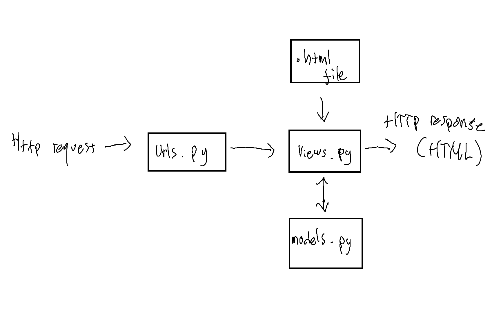

<h4>1. Jelaskan bagaimana cara kamu mengimplementasikan checklist di atas secara step-by-step (bukan hanya sekadar mengikuti tutorial).</h4>

- Membuat direktori lokal untuk project  
- Inisiasi git  
- Buat dan aktifkan virtual environment.  
- Menginstall dependencies.  
- Start project django  
- Mengatur konfigurasi Allowed hosts pada settings.py  
- Membuat aplikasi main dan menambahkannya ke daftar proyek  
- Membuat direktori untuk template dan menambahkan file template yaitu main.html  
- Mengisi main.html sesuai kebutuhan  
- Membuat model dengan nama Item dengan atribut nama, amount dan description  
- Migrasi model  
- Membuat fungi show_main pada berkas views.py dan mengisi data yang akan ditampilkan  
- Konfigurasi routing URL aplikasi main dengan menambahkan fungsi show_main ke list urlpatterns pada urls.py  
- Konfigurasi routing URL proyek  
- Buat repositori baru di github untuk proyek  
- Setelah keluar dari virtual environment, lakukan add dan commit pada direktori proyek  
- Buat branch utama baru, hubungkan direktori lokal dengan repositori github, lalu push

<h4>2. Buatlah bagan yang berisi request client ke web aplikasi berbasis Django beserta responnya dan jelaskan pada bagan tersebut kaitan antara urls.py, views.py, models.py, dan berkas html.</h4>

urls.py akan meneruskan request ke views.py, lalu views.py akan mengambil data yang diperlukan dari models.py lalu ditampilkan melalui berkas .html

<h4>3. Jelaskan mengapa kita menggunakan virtual environment? Apakah kita tetap dapat membuat aplikasi web berbasis Django tanpa menggunakan virtual environment?</h4>

Virtual environment digunakan untuk menghindari konflik dependencies dari proyek berbeda. Virtual environment mengisolasi package dan dependencies dari aplikasi 
Kita tetap bisa membuat aplikasi django tanpa virtual environment. Namun, jika kita mengerjakan lebih dari satu proyek dengan versi django yang berbeda, maka akan terjadi konflik akibat perbedaan versi django pada perangkat lokal.

<h4>4. Jelaskan apakah itu MVC, MVT, MVVM dan perbedaan dari ketiganya.</h4>

MVC, MVT dan MVVM merupakan design pattern yang digunakan dalam pemrograman berbasis platform. 
<b>MVC (Movdel-View-Controller)</b> 
- Model: Mewakili data dan logika bisnis 
- View: Menampilkan data kepada pengguna 
- Controller: Perantara antara view dan model, mengelola interaksi pengguna 
<b>MVT (Model-View-Template)</b> 
- Model: Mewakili data 
- View: Bagian logika bisnis, menampilkan template kepada pengguna 
- Template: Tampilan html yang dapat disesuaikan dengan input pada model 
<b>MVVM (Model-View-ViewModel)</b> 
- Model: Mewakili data 
- View: Menampilkan data kepada pengguna 
- ViewModel: Mengubah data dari Model menjadi format yang lebih sesuai untuk tampilan.  
ViewModel juga menangani perintah dari View dan memperbarui Model jika diperlukan. 

